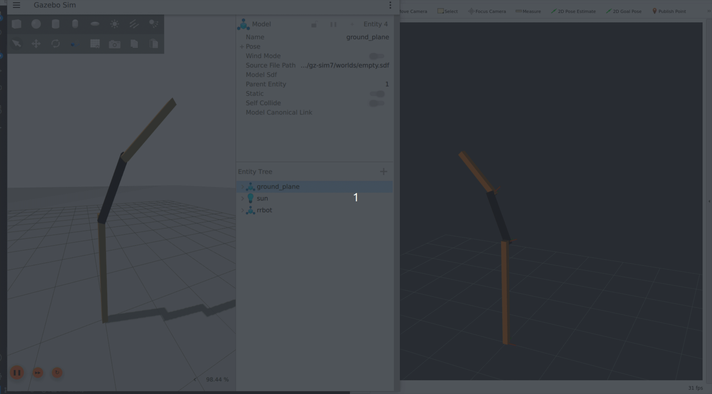
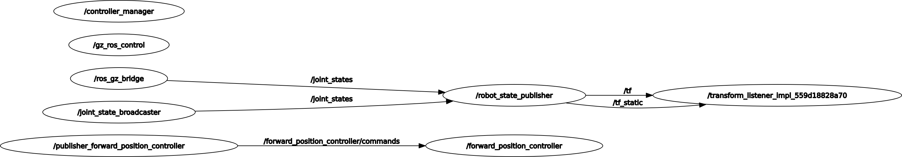

# Stack "rrbot_stack"

This is the stack for the RRBot robot with joint control in Gazebo and visualization in Rviz.
Basically, this is simple demonstration of using RRBot with Gazebo Sim and ros_controlers (gz_sim_ros_control).

It is based on examples in [ros2_control_demos](https://github.com/ros-controls/ros2_control_demos/tree/master) and [ros_gz_sim_demos](https://index.ros.org/p/ros_gz_sim_demos/#rolling).

## Demonstration




## Repository Structure
This project has been organized in stacks for better modularity and reusability

  
```
	├──rrbot_description/ 				#contains the urdf description and and assets for robot representation in sims and ROS
  	│	└──urdf/				#contains the URDF description files of the rrbot_robot
  	├──rrbot_gazebo/ 				#contains the aditional elements for Gazebo simulation
  	│	├──worlds/ 				#basic Gazebo worlds for demonstrations
  	│	└──launch/
	│		└──rrrbot_gz_sim.launch.py		#spawn the rrbot_robot in Gazebo simulation 
  	├──rrbot_control/ 				#ros controllers for robot operation in the ROS eco-system
	│	├──rrbot_control/			#variouses nodes
  	│	├──config/				# Ros control configs and targets
  	│	└──launch/ 
	│		└──test_forward_position_controller.launch.py		#generates various joint angle targets
	│		└──rrbot_base.launch.py		#spawn the robot in rviz and gazebo with various parameters
  	├──media/  					#miscelaneous material : videos, tutos, etc...
```


## How to use

### Prepare your work environment

* Option A : Deploy on your Linux (Ubuntu 22.04 recommended)

[Install ROS2](https://docs.ros.org/en/humble/Installation/Ubuntu-Install-Debians.html), in version **Full-Desktop**, install Gazebo Sim and configure your [work environment](https://docs.ros.org/en/humble/Tutorials/Configuring-ROS2-Environment.html)  
(This code has been tested on ROS2 Rolling  and Gazebo Sim (ex Ignition) Fortress..

Make sure you have the necessary dependencies by typing in the terminal :  
	```
	sudo apt install ros-rolling-ros2-controllers-test-nodes
	```


### Run the stack

1. Clone this repository in you colcon workspace:   
	`colcon_ws/src`

2. Open a terminal in your catkin_ws:  
	`colcon build`
	
3. Launch the full demo:
`ros2 launch rrbot_bringup rrbot_bringup.launch.py`

For your reference, the bringup file calls for : `rrbot_base.launch.py`  and
`test_forward_position_controller.launch.py` 


At this point, tou should have Gazebo Sim and rviz windows running and see the arm move every 2 seconds.
	
	
### ROS Graph


## Troubleshoot

If you have error messages, you might need to install aditionnal packages
```
sudo apt install ros-humble-gazebo-ros
sudo apt install ros-humble-joint-state-publisher-gui
sudo apt install ros-humble-joint-state-publisher
```


## ToDo

* Finish readme
* Choose license

	
## Ressources

0. [A guide for ROS2 and Gazebo](https://automaticaddison.com/how-to-simulate-a-robot-using-gazebo-and-ros-2/)
1. [Use XACRO in ROS 2](https://answers.ros.org/question/361623/ros2-robot_state_publisher-xacro-python-launch/)
2. [Tutorial to load URDF in ROS2](https://github.com/olmerg/lesson_urdf)[and the related video](https://www.youtube.com/watch?v=IfpzNFKnkH0)
3. [ROSControl Documentation](https://ros-controls.github.io/control.ros.org/ros2_controllers/doc/controllers_index.html)
4. [A Tutorial on ROS_COntrol in C++](https://jeffzzq.medium.com/designing-a-ros2-robot-7c31a62c535a)


## License

MIT
