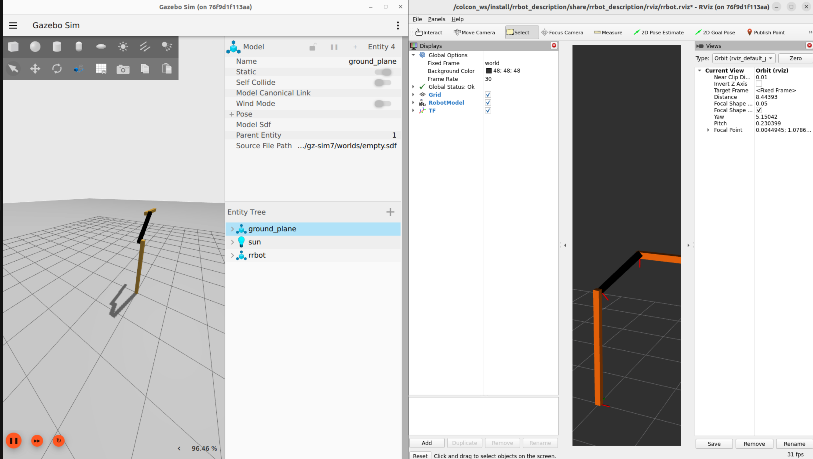

# Stack "rrbot_stack"

This is the stack for the RRBot robot with joint control in Gazebo and visualization in Rviz


## Demonstration




## Repository Structure
This project has been organized in stacks for better modularity and reusability

  
```
	├──rrbot_description/ 				#contains the urdf description and and assets for robot representation in sims and ROS
  	│	├──launch/
  	│	├──meshes/ 				#contains the stl files for acurate rendering
  	│	└──urdf/				#contains the URDF description files of the rrbot_robot
  	├──rrbot_gazebo/ 				#contains the aditional elements for Gazebo simulation
  	│	├──worlds/ 				#basic Gazebo worlds for demonstrations
  	│	└──launch/
	│		└──rrrbot_z_sim.launch		#spawn the rrbot_robot in Gazebo simulation (ex Ignition)
  	├──rrbot_control/ 				#ros controllers for robot operation in the ROS eco-system
	│	├──rrbot_control/			#variouses nodes
  	│	├──config/
  	│	└──launch/
  	├──media/  					#miscelaneous material : videos, tutos, etc...
```


## How to use

### Prepare your work environment

* Option A : Deploy on your Linux (Ubuntu 22.04 recommended)

[Install ROS2](https://docs.ros.org/en/humble/Installation/Ubuntu-Install-Debians.html), in version **Full-Desktop**, install Gazebo and configure your [work environment](https://docs.ros.org/en/humble/Tutorials/Configuring-ROS2-Environment.html)  
(This code has been tested on ROS2 Humble, Gazebo Classic 11 and Gazebo (ex Ignition) Garden. Several other branch (ros1 and ros Galactic exist with EoL support).

Make sure you have the necessary dependencies by typing in the terminal :  
	```
	sudo apt install ros-humble-xacro -y; sudo apt install ros-humble-joint-state-publisher-gui -y; sudo apt install ros-humble-ros2-control -y; sudo apt install ros-humble-ros2-controllers -y; sudo apt install ros-humble-gazebo-ros2-control -y
	```


### Run the stack

1. Clone this repository in you colcon workspace:   
	`colcon_ws/src`

2. Open a terminal in your catkin_ws:  
	`colcon build`
	
3. Launch the demo for RViz:  
	`ros2 launch rrbot_control rrbot_base.launch.py` 

4. In another terminal, launch the joints angle publisher :
	`ros2 launch rrbot_control test_forward_position_controller.launch.py` 


	
	


## Troubleshoot

If you have error messages, you might need to install aditionnal packages
```
sudo apt install ros-humble-gazebo-ros
sudo apt install ros-humble-joint-state-publisher-gui
sudo apt install ros-humble-joint-state-publisher
```


## ToDo

* Finish readme
* Choose license

	
## Ressources

0. [A guide for ROS2 and Gazebo](https://automaticaddison.com/how-to-simulate-a-robot-using-gazebo-and-ros-2/)
1. [Use XACRO in ROS 2](https://answers.ros.org/question/361623/ros2-robot_state_publisher-xacro-python-launch/)
2. [Tutorial to load URDF in ROS2](https://github.com/olmerg/lesson_urdf)[and the related video](https://www.youtube.com/watch?v=IfpzNFKnkH0)
3. [ROSControl Documentation](https://ros-controls.github.io/control.ros.org/ros2_controllers/doc/controllers_index.html)
4. [A Tutorial on ROS_COntrol in C++](https://jeffzzq.medium.com/designing-a-ros2-robot-7c31a62c535a)


## License

Tbd
