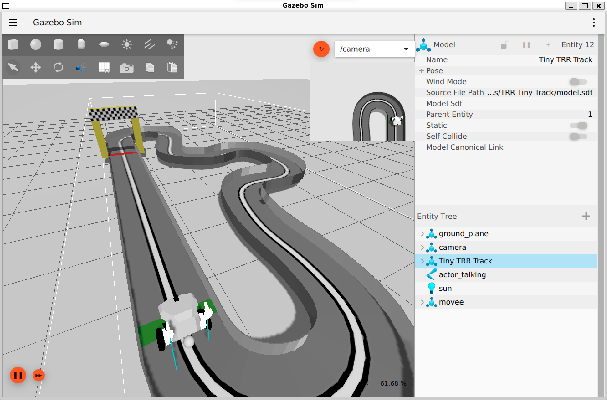

# Package "rrbot_bringup"

Instruction to use rrbot on the TRR track simulation

## Demonstration

## Install the package TRR Tiny Track

Clone the repo in your workspace 

`git clone https://gitlab.com/kytheralab/applications/trr_stack.git`

Compile your workspace from your workspace root

`colcon_build`

Export the path to trr_stack_models to GZ_SIM_RESOURCE_PATH :

`export GZ_SIM_RESOURCE_PATH="/your_ws_path/src/trr_stack/models"`

Launch the simulation :

`ros2 launch rrbot_bringup rrbot_bringup.launch.py use_rviz:=true`